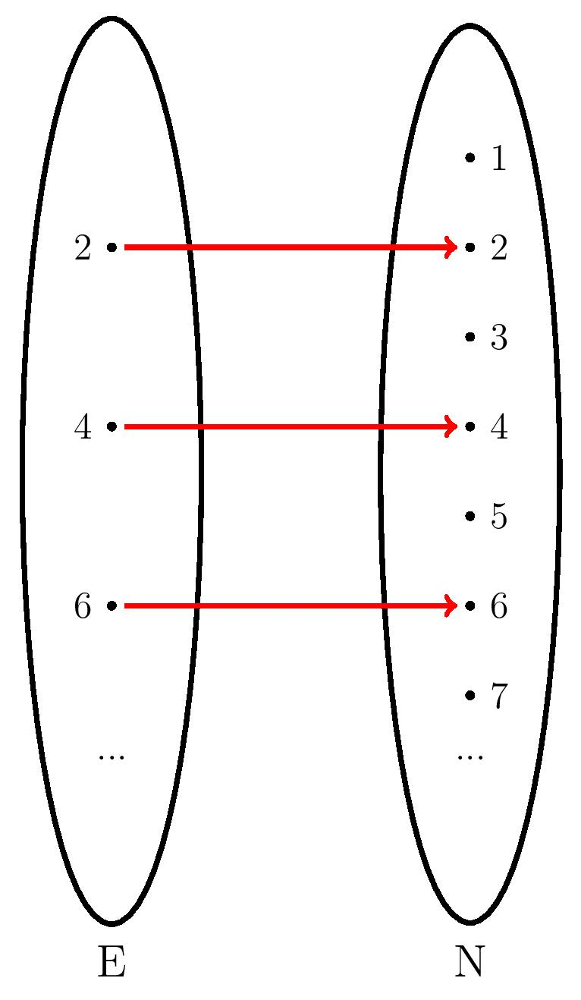
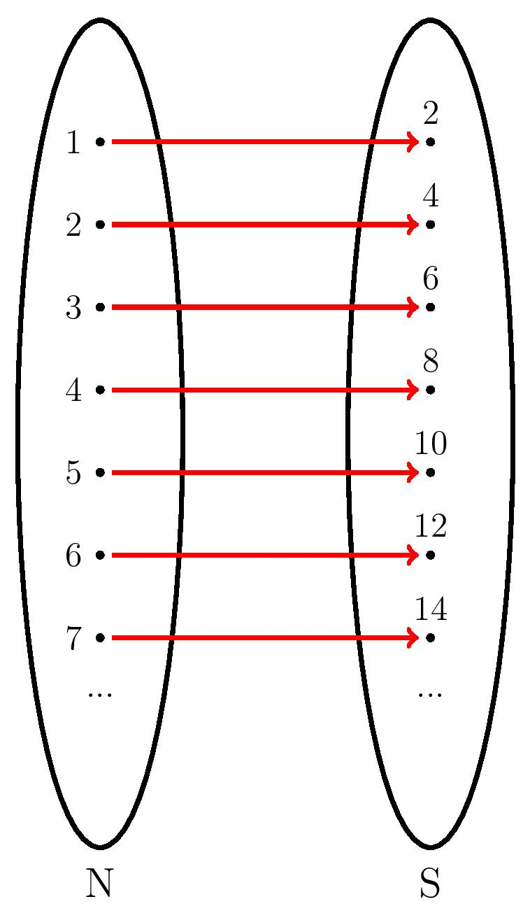
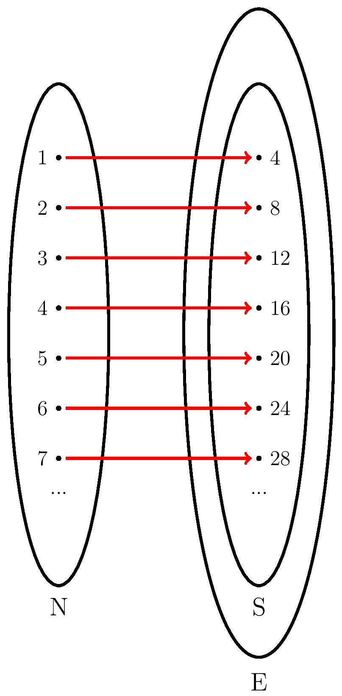

## $\mathrm{Text Book}$
INTRODUCTION TO REAL ANALYSIS, by Robert G. Bartle & Donald R. Sherbert, 4th edition

## $\S 1.2,1.3\ \mathrm{Principle\ of\ Induction}$ 

Induction Definition

Let $n\in\mathbb{N}$ (from 1) and $P(n)$ be a statement. Suppose that

1. $P(n_0)$ is true ( $n_0\in\mathbb{N}$ )
2. If $P(n_0)$ is true, then $P(n+1)$ is true

Then $P(n)$ is true for all $n\in\mathbb{N}, n\ge n_0$.

 

Strong Induction Definition

Let $n\in\mathbb{N}$ and $P(n)$ be a statement. Suppose that

1. $P(n_0)$ is true ( $n_0\in\mathbb{N}$ )
2. If $P(n_0), P(n_0+1), …, P(k)$ are true, then $P(k+1)$ is true

Then $P(n)$ is true for all $n\in\mathbb{N}, n\ge n_0$.

---

**Example 1**: Show that $n<2^n$ for all $n\in\mathbb{N}$

*Base step*: Let $n=1$, then $1<2^1=2$. Thus, we prove that $P(1)$ is true.

*Inductive step*: Assume $n<2^n$, show that $(n+1)<2^{n+1}$. 
&emsp;&emsp;&emsp;&emsp;&emsp;&emsp;&emsp;&thinsp;Since $n<2^n$, $n+1<2^n+1<2^n+2^n=2^{n+1}$, it concludes that $n+1<2^{n+1}$. 

Therefore, by induction, we prove that $n<2^n$.

 
 

**Example 2**: Prove that $2n-3\leq 2^{n-2}$ for all $n \geq 5$, $n\in \mathbb{N}$.

*Base step*: Let $n=5$, then $7<2^{3}$. Thus, we prove that $P(1)$ is true.

*Inductive step*: Assume $2n-3\leq 2^{n-2}$, show that $2n-1\leq 2^{n-1}$, i.e., $2(n+1)-3\leq 2^{(n+1)-2}$.

$$\begin{aligned}
2n-3\leq 2^{n-2}&\Rightarrow 2n-3+2\leq 2^{n-2}+2\leq 2^{n-2}+2^{n-2} \\
&\Rightarrow 2n-1\leq 2^{n-2}+2\leq2^{n-1} \\
&\Rightarrow 2n-1\leq 2^{n-1}
\end{aligned}$$

Therefore, by induction, we prove that $2n-3\leq 2^{n-2}$ for all $n \geq 5$.

 
 

**Example 3**: Let $(a_n)\_{n\in\mathbb{N}}$ be a sequence, satisfying $a_1=2, a_2=8$, and $a_n=4(a_{n-1}-a_{n-2}), n\ge 3$. Show that $a_n=n\cdot2^n$

*Base step*: Let $n=1$, then $a_1=2=1\cdot2^1$. 
&emsp;&emsp;&emsp;&emsp;&emsp;&thinsp;Let $n=2$, then $a_2=8=2\cdot2^2$. 
&emsp;&emsp;&emsp;&emsp;&emsp;&thinsp;Thus, we prove that both $P(1)$ and $P(2)$ are true.

*Inductive step*: Assume $a_j=j\cdot2^j$ for all $1\le j\le k$. Show that $a_{k+1}=(k+1)\cdot2^{k+1}$ 
&emsp;&emsp;&emsp;&emsp;&emsp;&emsp;&emsp;&thinsp;Since $a_{k+1}=4(a_k-a_{k-1})$, by strong induction, $a_{k+1}=4(k2^k-(k-1)2^{k-1})=4(2^{k-1})(2k-k+1)=(k+1)2^{k+1}$

Therefore, by strong induction, we prove that $a_n=n\cdot2^n$

 
 

**Example 4**: Let the numbers $x_n$ be defined as follows: $x_1 \coloneqq1, x_2 \coloneqq2$, and $x_{n+2} \coloneqq\frac{1}{2}(x_{n+1} + x_n)$ for all $n\in N$. Use the Principle of Strong Induction to show that $1 \leq x_n\leq 2$ for all $n \in \mathbb{N}$.

*Base step*: Let $n=1, x_1=1, 1\le x_1\le2$ 
&emsp;&emsp;&emsp;&emsp;&emsp;&thinsp;Let $n=2, x_2=2, 1\le x_2\le2$ 
&emsp;&emsp;&emsp;&emsp;&emsp;&thinsp;Thus, we prove that both $P(1)$ and $P(2)$ are true.

*Inductive step*: Assume $x_j\coloneqq\frac{1}{2}(x_{j-1} + x_{j-2})$ for all $3\le j\le k$, s.t., $1\le x_j\le2$. Show that $x_{k+1}=\frac{1}{2}(x_{k}+x_{k-1})$. 
&emsp;&emsp;&emsp;&emsp;&emsp;&emsp;&emsp;&thinsp;By strong induction, $1\le x_k\le2$ and $1\le x_{k-1}\le2$.

$$\begin{aligned}
1\le x_k\le 2&\Rightarrow2\le x_k+x_{k-1}\le 4 \\
&\Rightarrow1\le \frac{1}{2}(x_k+x_{k-1})\le 2 \\
&\Rightarrow 1\le x_{k+1} \le 2
\end{aligned}$$

Therefore, by strong induction, we prove that $1 \leq x_n\leq 2$ for all $n \in \mathbb{N}$.

## $\S 1.1\ \mathrm{Sets\ and\ Functions}$

Injection, Surjection, and Bijection Definitions

Let $S$ be a set. Let $f: A\to B$, i.e. $a\to f(a)$, be a function.
1. If $f(x_1)\ne f(x_2)$ whenever $x_1\ne x_2$, then $f$ is called one-to-one, or injective.
2. If any $b\in B$, there is $a\in A$, s.t., $f(a)=b$, then $f$ is called onto, or surjective.
3. If $A\to B$ is both injective and surjective, then $f$ is called bijective (from $A$ to $B$).

 

Theorem 1

Let $A, B$ be sets. If there is bijection between $A$ and $B$, then we say $A$ and $B$ have the same cardinality.

 

Tricks for proving two infinite sets have the same cardinality

- Defining a bijection directly if the case is trivial, i.e., two sets are finite.
- Cantor-Schröder-Bernstein Theorem[1]: Let $S$ and $T$ be sets. Suppose there are injective functions $f: S \to T$ and $g: T \to S$. Then $S$ and $T$ have the same cardinality.

---

**Example 1**: Show that $E=\\{2n|n\in\mathbb{N}\\}$ and $\mathrm{N}$ have the same cardinality.

Since $E\subset\mathbb{N}$, there exists an intuitive injective function $f:E\to\mathbb{N}$, namely the identity function $f(x)=x,\forall x\in E$. Suppose $f(a)=f(b)$, then $f(a)=f(b)\Rightarrow a=b$. Hence, $f$ is injective. $\color{red}{(1)}$

Let $g:\mathbb{N}\to S$, s.t., $g(x) = 2x, \forall x\in\mathbb{N}$ and $S=\\{2x|x\in\mathbb{N}\\}$. Suppose $g(a)=g(b)$, then $g(a)=g(b)\Rightarrow 2a=2b\Rightarrow a=b$. Hence, $g$ is injective. $\color{red}{(2)}$

Since $S\subseteq E$, there exists an identity function $h:S\to E$, s.t., $h(x)=x,\forall x\in S$. Let $g':\mathbb{N}\to E$, s.t., $g'(x)=g(h(x)), \forall x\in\mathbb{N}$. If $g'(a)=g'(b)$, by injectivity for both $h$ and $g$, then $g'(a)=g'(b)\Rightarrow g(h(a))=g(h(b))\Rightarrow g(a)=g(b)\Rightarrow a=b$. Hence, $g'$ is injective. $\color{red}{(3)}$

Therefore, by Cantor-Schröder-Bernstein Theorem, $\mathbb{N}$ and $E$ have the same cardinality. $\color{red}{(4)}$

 
 

**Example 2**: Show that $(0,1)$ and $[0,1]$ have the same cardinality.

Since $(0,1)\subset[0,1]$, there exists an intutive function $f:(0,1)\to[0,1]$, namely the identity function $f(x)=x,\forall x\in (0,1)$. Suppose $f(a)=f(b)$, then $f(a)=f(b)\Rightarrow a=b$. Thus, $f$ is injective. $\color{red}{(1)}$ Let $g:[0,1]\to S$, s.t., $g(x) = \frac{1}{2}x+\frac{1}{10}, \forall x\in[0,1]$ and $S=[\frac{1}{10},\frac{3}{5}]$. Suppose $g(a)=g(b)$, then $g(a)=g(b)\Rightarrow \frac{1}{2}a+\frac{1}{10}=\frac{1}{2}b+\frac{1}{10}\Rightarrow\frac{1}{2}a=\frac{1}{2}b\Rightarrow a=b$. Thus, $g$ is injective. $\color{red}{(2)}$ Since $S\subset (0,1)$, there exists an identity function $h:S\to(0,1)$, s.t., $h(x)=x,\forall x\in S$. Let $g':[0,1]\to (0,1)$, s.t., $g'(x)=g(h(x)), \forall x\in[0,1]$. If $g'(a)=g'(b)$, by injectivity for both $h$ and $g$, $g'(a)=g'(b)\Rightarrow a=b$. Thus, $g'$ is injective. $\color{red}{(3)}$ Therefore, by Cantor-Schröder-Bernstein Theorem, $[0,1]$ and $(0,1)$ have the same cardinality. $\color{red}{(4)}$

 
 

**Example 3**: Show that $\[0,1)$ and $(2,4]$ have the same cardinality.

Let $T$ be an interval, s.t., $T=[0,4]$.

Since $\[0,1)\subset T$, there exists a function, $f:\[0,1)\to T$, namely the identity function $f(x)=x,\forall x\in\[0,1)$. If $f(a)=f(b)$, then $a=b$. Hence, $f$ is injective. $\color{red}{(1)}$ Let $g:T\to S$, s.t., $g(x)=\frac{1}{8}x,\forall x\in T$ and $S=[0, \frac{1}{2}]$. Suppose $g(a)=g(b)$, then $\frac{1}{8}a=\frac{1}{8}b\Rightarrow a=b$. Thus, $g$ is injective. $\color{red}{(2)}$ Since $S\subset\[0,1)$, we have an identity function $h:S\to\[0,1)$, s.t., $h(x)=x,\forall x\in S$. Let $g\circ h:T\to\[0,1)$. Suppose $(g\circ h)(a)=(g\circ h)(b)$, by injectivity for both $h$ and $g$, $g(h(a))=g(h(b))\Rightarrow g(a)=g(b)\Rightarrow a=b$. Therefore, $g\circ h$ is injective. $\color{red}{(3)}$ Thus, by Cantor-Schröder-Bernstein Theorem, we prove that $T$ and $\[0,1)$ have the same cardinality. $\color{red}{(4)}$

Similarly, we can use the same approach to prove that $T$ and $(2,4]$ have the same cardinality.

Since $|\[0,1)|=|T|$ and $|(2,4]|=|T|$, in conclusion, $\[0,1)$ and $(2,4]$ have the same cardinality.

 
 

**Example 4**: Show that $\mathbb{N}$ and $\mathbb{Q}$ have the same cardinality.

---

Further Reading

[1]: [Class Notes from Millersville University](https://sites.millersville.edu/bikenaga/math-proof/cardinality/cardinality.pdf) 
[2]: [Proof of Cantor-Schröder-Bernstein Theorem](http://www.cs.cornell.edu/courses/cs2800/2017fa/lectures/lec14-cantor.html)

